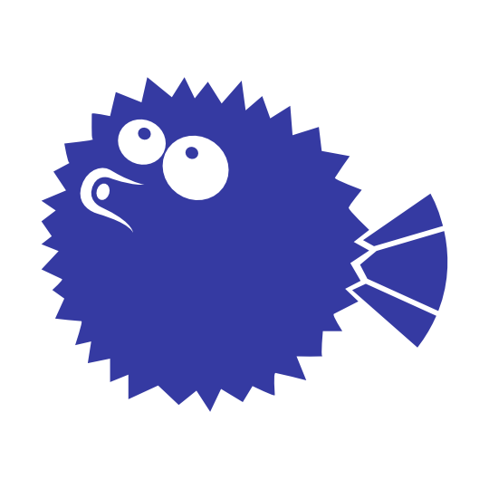

# OpenSSH Client

> A handy Docker Image for connecting through SSH to remote hosts with _optional_ support for SSH host keys.



## Setup
### Environment Variables

These variables are set in GitLab CI/CD settings (but could be any CI/CD pipeline service):
- `SSH_HOST` (remote's hostname)
- `SSH_KNOWN_HOSTS` (host's key signature, can be set to `NoStrictHostKeyChecking` to not check)
- `SSH_USER_NAME` (ssh username for access to the host)
- `SSH_PRIVATE_KEY` (ssh private key for SSH_USER_NAME)

### Generating SSH_PRIVATE_KEY

Need some new keys? You can use this image to generate them (no messing up your local machine with keys - and adding to your "vector").

```sh
docker run --rm --entrypoint keygen.sh mountainash/openssh-client:latest
```

Four different types (dsa, ecdsa, ed25519, or rsa) public and private authentication keys will be printed to stdout. Pick your perferred key type and copy & paste into your CD/CI settings.

### Getting SSH_KNOWN_HOSTS

SSH to the server and run `ssh-keyscan` on the full domain name of the `SSH_HOST`:

```sh
ssh-keyscan hostname.com
```

### GitLab CI/CD Example

Create a `.gitlab-ci.yml` file in the root of your project to trigger SSH commands on a remote server on commit to the `master` branch.

```yml
deploy:
  image: mountainash/openssh-client:latest
  only:
    - master
  environment:
    name: production
    url: https://domainname.com/
  variables:
    GIT_STRATEGY: none
    GIT_SUBMODULE_STRATEGY: none
  script:
    - ssh $SSH_USER_NAME@$SSH_HOST "cd /www && git pull origin master && exit"
  allow_failure: false
```

`image` can also be pulled from `registry.gitlab.com/containeryard/openssh`

## Contribute

- GitLab: https://gitlab.com/containeryard/openssh/container_registry

## Credits

Based on https://github.com/chuckyblack/docker-openssh-client / https://hub.docker.com/r/jaromirpufler/docker-openssh-client but added host keys support

Pufferfish by [Catalina Montes from the Noun Project](https://thenounproject.com/term/pufferfish/181192/)